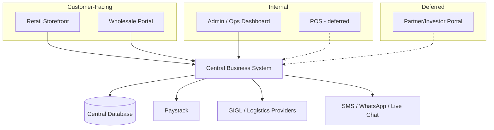

# 04. Product Architecture

## System overview

## Applications / surfaces

1. **Retail Storefront** (public-facing web, mobile-friendly) — Discover → cart → checkout → track → review.
2. **Wholesale Portal** (authenticated) — Wholesale pricing, bulk ordering, invoices, custom design submission.
3. **Admin / Operations Dashboard** (internal, role-restricted) — Manufacturing, inventory, orders, accounting, analytics, staff, approvals — the primary tool for Business Owner/Admin, Sales, Inventory, Production, Finance, and Management roles.
4. **Partner/Investor Portal** (deferred) — Read-mostly view: business overview, investment info, performance, inventory visibility, accounts/reports, profit sharing.
5. **POS / Mall Sales System** (deferred, scope TBD)

## Why one central system

All surfaces above must read/write through the same core business system — the client was explicit that no sales channel (online, in-store, wholesale) should operate in isolation. This is the single most important architectural constraint: **there is one source of truth for inventory, orders, and money**, not four separate silos with reconciliation later.

## Core domains inside the Central Business System

- Catalogue (Products, Variants, Collections)
- Manufacturing (Batches, Costs, QC/Rejections)
- Inventory (Movement ledger)
- Sales (Orders, Payments, Returns) — spans retail + wholesale + custom
- Accounting (Ledger, Reports)
- Logistics (Deliveries, Tracking)
- People (Users, Roles, Partners, Customers)
- Governance (Approvals, Audit Trail)
- Engagement (Marketing, Notifications, Reviews)

## Integration boundary

External services (Paystack, GIGL, SMS/WhatsApp providers) are accessed through dedicated integration modules/adapters within the core system — never called directly from the storefront or portal frontends. This keeps API keys server-side and makes it possible to swap providers later (e.g. adding a second logistics company beyond GIGL) without touching frontend code.

## Related documents

`07-Technical-Architecture.md` (how this is actually built), `08-Initial-Data-Model.md` (the data behind each domain).
