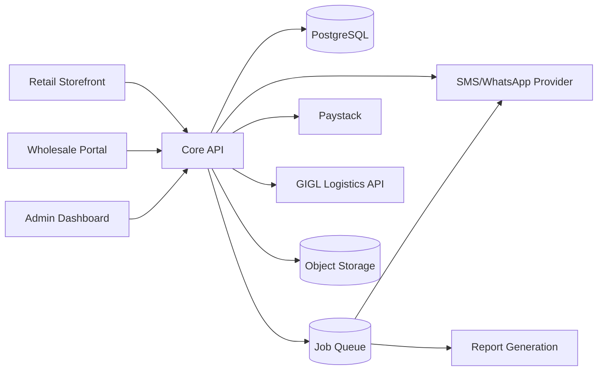

# 07. Technical Architecture

## Confirmed engineering stack

| Concern | Choice | Rationale |
|---|---|---|
| Frontends | **Angular** (all user-interaction surfaces) | Confirmed by engineering team for Sprint 0 |
| Backend API | **Node.js + NestJS** | Confirmed; modular architecture matches the domain split |
| Database | **PostgreSQL** | Relational integrity needed for inventory/accounting; strong audit/ledger support |
| File/image storage | S3-compatible object storage (AWS S3 or DigitalOcean Spaces) | Product images, review photos |
| Auth | JWT-based session + role-based access control (RBAC) | Matches `05-Role-Permission-Matrix.md` |
| Payments | Paystack (confirmed) | Client-specified |
| SMS/WhatsApp | Termii or Twilio (TBD) | Local Nigerian delivery reliability — confirm provider |
| Logistics | GIGL API integration first (confirmed), designed as a pluggable adapter for future carriers | Client-specified |
| Hosting | AWS or DigitalOcean (TBD by team/budget) | Either works for this scale |
| Background jobs | A queue (e.g. BullMQ on Redis) for notifications, report generation | Keeps API responsive |

## System diagram

## Architectural principles (non-negotiable, derived from client requirements)

1. **Single source of truth.** One Core API and one database serve all frontends — no channel-specific data silos.
2. **Inventory is event-sourced.** Never mutate a stock count directly; always write an `InventoryMovement` record and derive the current count. This directly satisfies the client's explicit requirement for reliable movement history.
3. **Money-moving and stock-moving actions are approval-gated at the API layer**, not just hidden in the UI — a request to change price or move funds without proper approval state should be rejected server-side.
4. **Everything writes to the audit log.** Implement as a database trigger or service-layer interceptor, not something each feature remembers to call manually.
5. **Currency and locale are configuration**, not hardcoded (pending Open Question #6).

## Security requirements

- All customer PII (name, phone, location, order history) encrypted at rest; access logged.
- Role-based access control enforced server-side on every endpoint, not just hidden in the frontend.
- Payment credentials (Paystack keys) never exposed to frontend code.
- Pending Open Question #7: confirm NDPR compliance requirements before finalizing data retention and export policies.

## Environments

Development → Staging → Production (see `12-Operations-Deployment-Guide.md` for details).
