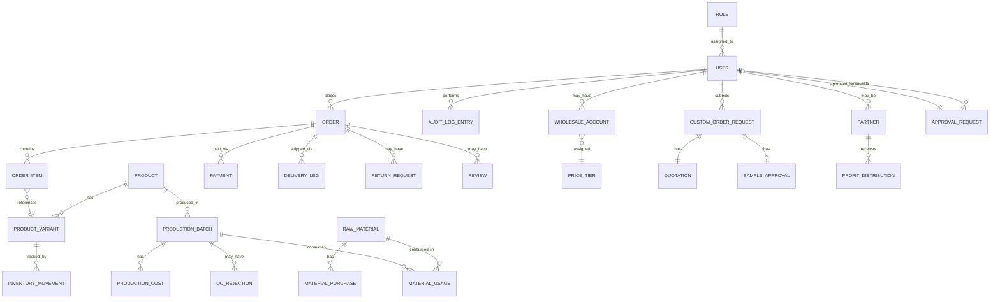

# 08. Initial Data Model

This is a first-pass entity list derived from the approved requirements. Expect refinement during technical design, but this should be a solid starting point for the database schema.

## Entity-relationship overview

## Core entities

### User & Access
- **User**: id, name, phone, email, role_id, status
- **Role**: id, name (Business Owner/Admin, Sales, Inventory, Production, Finance/Accounting, Management, Partner/Investor, Customer)
- **Permission**: role_id, module, access_level (F/V/A/O/–)

### Catalogue
- **Product**: id, name, description, category, base_price
- **ProductVariant**: id, product_id, size, colour, SKU, price_override, image_url, availability_status
- **Collection**: id, name

### Manufacturing
- **ProductionBatch**: id, product_id, quantity, stage, planned_date, completed_date
- **ProductionCost**: id, batch_id, material_cost, sewing_cost, branding_cost, packaging_cost
- **QCRejection**: id, batch_id, reason, disposition (burned | repaired_restocked), date

### Raw Materials
- **RawMaterial**: id, name, unit, current_quantity, reorder_threshold
- **MaterialPurchase**: id, material_id, date, quantity, cost, note
- **MaterialUsage**: id, material_id, batch_id, quantity_used, date

### Inventory
- **InventoryMovement**: id, variant_or_material_id, type (purchase | production | sale | return | damage | dispatch | adjustment), quantity_delta, actor_id, timestamp, reference_id

### Sales
- **Order**: id, customer_id, channel (retail | wholesale | custom | in_store), status, payment_status, created_at
- **OrderItem**: id, order_id, variant_id, quantity, unit_price
- **Payment**: id, order_id, method (paystack | cash | pos | bank_transfer), amount, status, recorded_by, date
- **DeliveryLeg**: id, order_id, carrier, leg_number, status, tracking_ref
- **ReturnRequest**: id, order_id, variant_id, reason, requested_at, return_deadline, tracking_number, resolution, restocked (bool), damaged (bool)
- **Review**: id, order_id, variant_id, customer_id, rating, comment, created_at, status (pending | published) — pending Open Question #4

### Wholesale
- **WholesaleAccount**: id, user_id, tier_id, approved_moq_status
- **PriceTier**: id, name, rule_description — pending Open Question #2

### Custom Orders (post-MVP)
- **CustomOrderRequest**: id, buyer_id, sizes, colours, quantity, location, fabric_quality, description, desired_date, status
- **Quotation**: id, request_id, amount, approved_by, created_at
- **SampleApproval**: id, request_id, sample_status, buyer_approved (bool), date

### Accounting
- **LedgerEntry**: id, type (sale | expense | purchase | payroll | tax), amount, category, date, reference_id
- **FinancialReport**: id, type, period, generated_data

### Partners (post-MVP)
- **Partner**: id, user_id, equity_percentage, invested_amount
- **ProfitDistribution**: id, period, total_profit, reinvestment_amount, dividend_pool, reserve_amount, per_partner_breakdown (JSON)

### Governance
- **ApprovalRequest**: id, action_type, requested_by, status, approved_by, decided_at
- **AuditLogEntry**: id, actor_id, action, before_state (JSON), after_state (JSON), timestamp

### Engagement
- **Notification**: id, recipient_id, channel, type, related_order_id, sent_at
- **Campaign**: id, name, type, start_date, end_date

## Notes for the engineer implementing this

- **InventoryMovement is the source of truth for stock** — `current_quantity` fields elsewhere should be derived/cached, not authoritative.
- **AuditLogEntry should be written automatically** (trigger or interceptor), not manually per-feature, to avoid gaps in coverage.
- Currency fields should reference a configurable currency setting (pending Open Question #6), not assume a single hardcoded currency.
